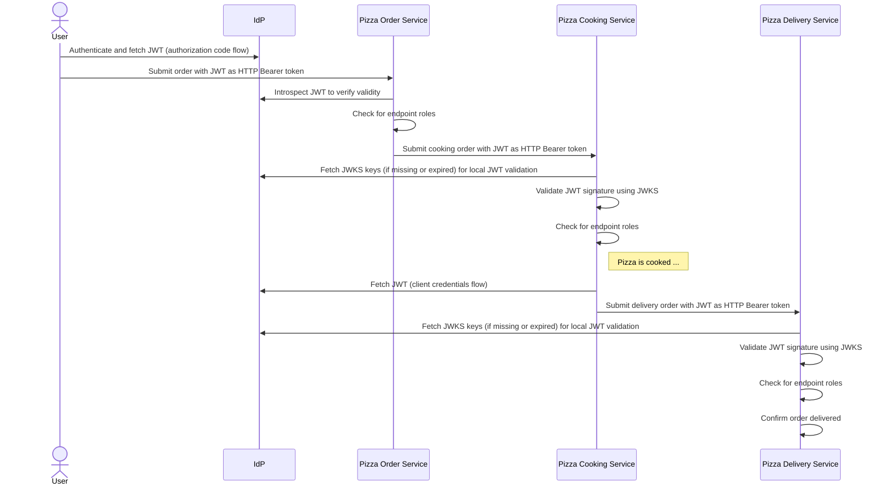

<p align="center">
  
</p>

<h1 align="center">Java Application Security Practices</h1>
<h4 align="center">⚡️ Secure by Design: Empowering Java Developers with Best Practices. ⚡️</h4>

---

This repository provides practical examples and code snippets aimed at helping Java developers implement security best practices. It covers key topics such as security design principles, authentication and authorization, API security, Java process security, common attack mitigations, and security testing - all essential for building secure Java applications.

These examples are designed to complement the curriculum of the 📚 [Application Security for Java Developers](https://ionutbalosin.com/training/application-security-for-java-developers-course) Course. 

If you're looking to take your skills to the next level, 🎓 [enroll now](https://ionutbalosin.com/training/application-security-for-java-developers-course) and master the art of secure coding in Java!

For more resources and insights, feel free to visit my [website](https://ionutbalosin.com).

---

## Content

- [Security Concepts](#security-concepts)
- [Project Modules](#project-modules)
- [Architectural Diagrams](#architectural-diagrams)
  - [Software Architecture Diagram](#software-architecture-diagram)
  - [Sequence Diagram](#sequence-diagram) 
- [Technology Stack](#technology-stack)
- [SetUp](#setup)
- [Security Checks](#security-checks)
  - [OWASP Dependency-Check](#owasp-dependency-check)
  - [SpotBugs with FindSecBugs Plugin](#spotbugs-with-findsecbugs-plugin)
  - [Zed Attack Proxy (ZAP)](#zed-attack-proxy-zap)
- [License](#license)

## Security Concepts

Among the **security concepts** demonstrated in this project:

- Security Design Principles
  - Least privilege
  - Defense in depth
  - Fail securely
  - Compartmentalization
- OAuth 2.0 Grant Types:
  - Password Flow
  - Client Credentials Flow
  - Authorization Code Flow
  - Authorization Code Flow with Proof Key for Code Exchange (PKCE)
- API and Microservices Security
  - Token introspection
  - JSON Web Key Set (JWKS)
  - Roles-based access control
- Java Process Security
  - Input data validation and sanitization
  - Handling input files from external sources
  - Security logging best practices
  - Content Security Policy (CSP)
  - Cross-Origin Resource Sharing (CORS)
  - HTTP security headers (e.g., Strict-Transport-Security, X-XSS-Protection, X-Frame-Options)
  - Java deserialization
- Security Testing
  - Software Composition Analysis (SCA)
  - Static Application Security Testing (SAST)
  - Dynamic Application Security Testing (DAST)

## Project Modules

Below is a breakdown and description of each module in the current project.

Module                                                  | Description                                                                                                                                                                                                                                                                                                                                   |
------------------------------------------------------- |-----------------------------------------------------------------------------------------------------------------------------------------------------------------------------------------------------------------------------------------------------------------------------------------------------------------------------------------------|
`pizza-order-*`, `pizza-cooking-*`, `pizza-delivery-*`  | These modules represent 3 microservices and their APIs (Pizza Cooking, Delivery, and Order) that demonstrate various OAuth 2.0 flows (e.g., token introspection, JWKS, client credentials), roles-based access control and security logging concepts.                                                                                         |
`security-feign-logger-enricher`                        | Enriches and enables standard Feign client logging with additional custom Mapped Diagnostic Context (MDC) attributes (e.g., correlation ID) using SLF4J's MDC.                                                                                                                                                                                |
`security-slf4j-logger-enricher`                        | Enriches SLF4J-based logging with security-specific attributes (e.g., remote host, remote port, user agent, request URI, request method, correlation ID) using SLF4J's MDC.                                                                                                                                                                   |
`security-token-client-credentials-fetcher`             | Fetches tokens from the Identity Provider (IdP) using the client credentials flow.                                                                                                                                                                                                                                                            |
`security-token-introspection`                          | Introspects and validates access tokens using the IdP's token introspection endpoint. Additionally, it disables security for specific `/public` endpoints (e.g., OpenAPI definition endpoint), configures CORS and Content Security Policy (CSP), adds HTTP security headers, and parses JWT claim roles, adding them as granted authorities. |
`security-token-jwks`                                   | Handles JSON Web Key Set (JWKS) validation and signature verification of JWT tokens using the IdP's JWKS endpoint. Additionally, it disables security for specific `/public` endpoints (e.g., OpenAPI definition endpoint) and parses JWT claim roles, adding them as granted authorities.                                                    |
`serialization-deserialization`                         | Demonstrates security risks in serialization and deserialization, including exploits like Java class deserialization attacks, XML external entities, YAML bombs, and ZIP bombs.                                                                                                                                                               |

## Architectural Diagrams

### Software Architecture Diagram

This software architecture diagram illustrates the microservices as components within the system and highlights key security aspects, including OAuth 2.0 flows (e.g., JWT introspection, JWKS) and endpoint roles checks.


### Sequence Diagram



## Technology Stack

This project includes the following **technologies, frameworks, and libraries**:

- [Spring Boot](https://spring.io/projects/spring-boot)
- [Spotless](https://github.com/diffplug/spotless) as a code formatter
- [Docker compose](https://docs.docker.com/compose/)
- [Keycloak](https://www.keycloak.org/) as an Identity and Access Management solution
- [OWASP Dependency-Check](https://owasp.org/www-project-dependency-check) as a Software Composition Analysis (SCA) tool
- [Spotbugs](https://spotbugs.github.io/) with [FindSecBugs plugin](https://find-sec-bugs.github.io/) as a Static Application Security Testing (SAST) tool
- [The Zed Attack Proxy (ZAP)](https://github.com/zaproxy/zaproxy) as a Dynamic Application Security Testing (DAST) tool
- [OWASP WebGoat](https://owasp.org/www-project-webgoat) a deliberately insecure application

## SetUp

### Tools to Download and Install

Please ensure you have properly downloaded, installed, and configured the following tools:

Tool                         | Link                                                                                              |
---------------------------- |---------------------------------------------------------------------------------------------------|
JDK 21                       | [Download](https://projects.eclipse.org/projects/adoptium.temurin/downloads) _(i.e., latest LTS)_ |
Docker                       | [Download](https://docs.docker.com/engine/install/)                                               |
Postman                      | [Download](https://www.postman.com/)                                                              |
`curl` command line          | [Download](https://everything.curl.dev/install/index.html)                                        |
`jq` command line            | [Download](https://jqlang.github.io/jq/download/)                                                 |


The course is developed to work best on **GNU/Linux**. However, if you prefer to use a **Windows** machine, you can use one of the following alternatives to properly execute the bash scripts: 
- [GIT bash](https://git-scm.com/downloads)
- [Cygwin](https://www.cygwin.com/)
- Windows Subsystem for Linux (WSL)
 
### Compile, Run Tests, and Package

To compile the project, run tests, and package it, use the following command:

```bash
./mvnw clean package
```

### Bootstrap Services with Docker

Please ensure that the Docker daemon is running; otherwise, the commands will not execute successfully.

1. Run the following command to start the `Keycloak` service in Docker:

    ```bash
    ./bootstrap-keycloak.sh
    ```

2. To start the `Pizza` application, which includes multiple microservices running in Docker, execute:
   
    ```bash
    ./bootstrap-pizza-application.sh
    ```

3. Next, run the following command to start the `OWASP WebGoat` application in Docker:
   
    ```bash
    ./bootstrap-webgoat.sh
    ```

4. Finally, check that all Docker containers are up and running by executing:

    ```bash
    docker ps -a
    ```

### Keycloak Configuration

To set up a basic Keycloak configuration, run the following script:

```bash
./keycloak-init.sh
```

The script creates OAuth 2.0 clients, users, and roles under the `master` realm and assigns the roles to the users:

 Type         | Name                  | Password                           | Purpose                                     |
--------------|-----------------------|------------------------------------|---------------------------------------------|
 User         | `demo_user`           | `Test1234!`                        | Used for authorization code flow with PKCE. |
 Client ID    | `demo_public_client`  | `6EuUNXQzFmxu6xwPHDvvoh56z1uzrBMw` | Used for authorization code flow.           |
 Client ID    | `demo_private_client` | `6EuUNXQzFmxu6xwPHDvvoh56z1uzrBMw` | Used for client credentials flow.           |

This setup utilizes [Keycloak's REST API](https://www.keycloak.org/docs-api/latest/rest-api/index.html) to perform these operations and provides output at each step, ensuring efficient user and client management within the Keycloak environment.

### Services Overview via UI

Open a browser and navigate to http://localhost:9090 to access the **Keycloak UI** (using the credentials `admin:admin`).

Open a browser and navigate to http://localhost:9090/realms/master/.well-known/openid-configuration to access the **Keycloak OpenID Connect configuration**.

Open a browser and navigate to http://localhost:18080/public/swagger-ui/index.html to access the **Pizza Order OpenAPI definition**.

Open a browser and navigate to http://localhost:28080/public/swagger-ui/index.html to access the **Pizza Cooking OpenAPI definition**.

Open a browser and navigate to http://localhost:38080/public/swagger-ui/index.html to access the **Pizza Delivery OpenAPI definition**.

Open a browser and navigate to http://localhost:48080/WebGoat/login to access the **OWASP WebGoat UI**.

### Local Tests with Postman

1. Open `Postman` and import the [Postman collection](postman).
2. To simulate a basic test scenario, follow these steps in the given sequence:
  - a) Fetch the JWT token using either:
    - The **Password Flow**:
       ```
       POST http://localhost:9090/realms/master/protocol/openid-connect/token
       ```
    - Or the **Client Credentials Flow**:
       ```
       POST http://localhost:9090/realms/master/protocol/openid-connect/token
       ```      
    - Or the **Authorization Code Flow with PKCE**:
       ```
       POST http://localhost:9090/realms/master/protocol/openid-connect/auth
       ```   
  - b) Initiate an order request to the `pizza-order-service`:
       ```
       POST http://localhost:18080/pizza/orders
       ```

## Security Checks

### OWASP Dependency-Check

[OWASP Dependency-Check](https://owasp.org/www-project-dependency-check) is an open-source **Software Composition Analysis (SCA)** tool that identifies vulnerabilities in project dependencies, helping reveal and address known security risks.

To check for potential dependency vulnerabilities, execute the following command:

```bash
./mvnw clean compile org.owasp:dependency-check-maven:check
```

**Note:** The first run of this command might take a significant amount of time (e.g., a couple of minutes) to initially download the [NVD Data Feeds](https://nvd.nist.gov/vuln/data-feeds) hosted by NIST. 

### SpotBugs with FindSecBugs Plugin

[Spotbugs](https://spotbugs.github.io/) is an open-source static analysis tool that detects bugs in Java programs by analyzing bytecode.

With the help of the [FindSecBugs plugin](https://find-sec-bugs.github.io/) plugin, it can be used as a **Static Application Security Testing (SAST)** tool to identify security vulnerabilities in Java applications.

To check for potential code vulnerabilities, execute the following command:

```bash
./mvnw clean compile spotbugs:check
```

### Zed Attack Proxy (ZAP)

[The Zed Attack Proxy (ZAP)](https://github.com/zaproxy/zaproxy) is an open-source **Dynamic Application Security Testing (DAST)** tool specifically designed for identifying vulnerabilities in applications during runtime.

To check for API security vulnerabilities, execute the following command:

```bash
./zap-scan.sh
```

The command starts ZAP in Docker, launches an API scan using the [zap-api-scan rules](zap/zap-api-scan-rules.conf) against one of the services, and saves the scan report in the [./zap/reports](zap/reports) folder.

## License

This project is licensed under the Apache License, Version 2.0.

Please see the [LICENSE](license/LICENSE) file for full license.

```
/*
 * Application Security for Java Developers
 *
 * Copyright (C) 2024 Ionut Balosin
 * Website: www.ionutbalosin.com
 * X: @ionutbalosin | LinkedIn: ionutbalosin | Mastodon: ionutbalosin@mastodon.social
 *
 * Licensed to the Apache Software Foundation (ASF) under one
 * or more contributor license agreements.  See the NOTICE file
 * distributed with this work for additional information
 * regarding copyright ownership.  The ASF licenses this file
 * to you under the Apache License, Version 2.0 (the
 * "License"); you may not use this file except in compliance
 * with the License.  You may obtain a copy of the License at
 *
 *   http://www.apache.org/licenses/LICENSE-2.0
 *
 * Unless required by applicable law or agreed to in writing,
 * software distributed under the License is distributed on an
 * "AS IS" BASIS, WITHOUT WARRANTIES OR CONDITIONS OF ANY
 * KIND, either express or implied.  See the License for the
 * specific language governing permissions and limitations
 * under the License.
 */
```