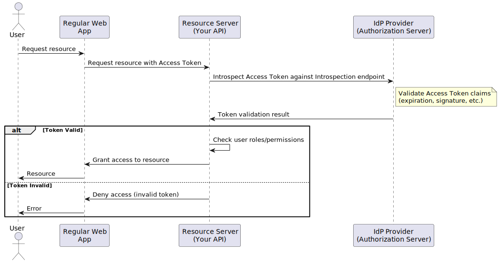
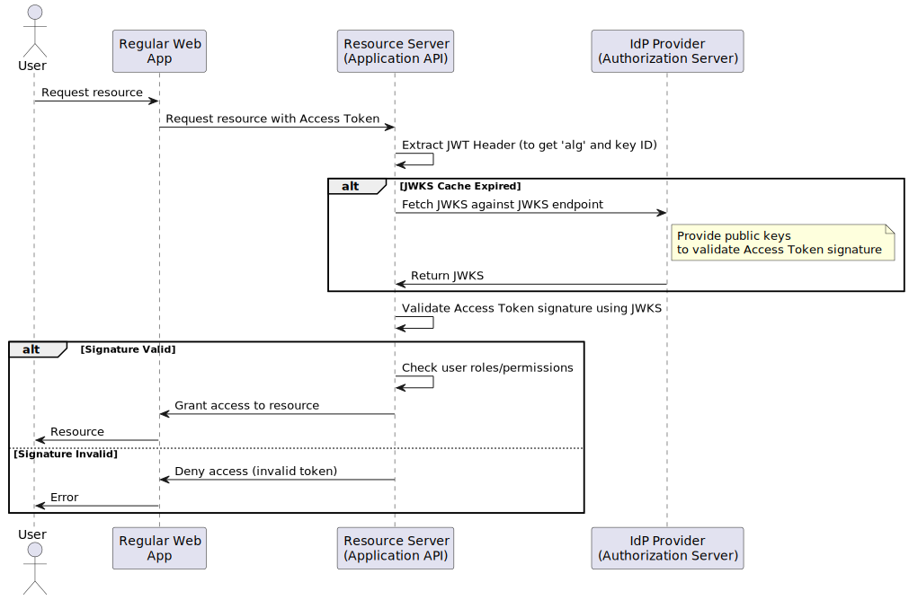
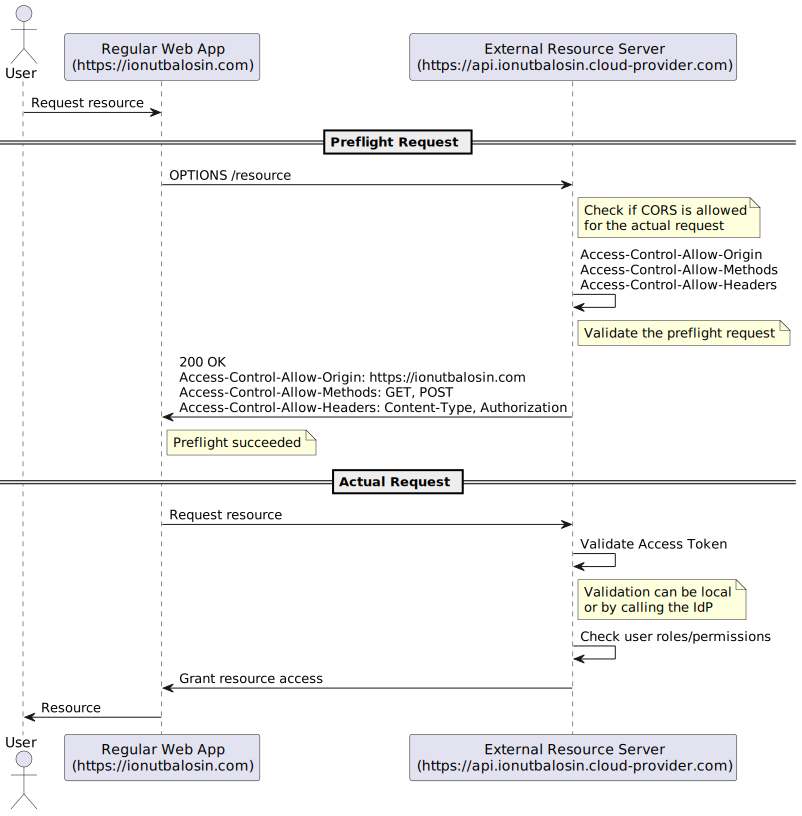

# API Web Application Security for Java Developers

## Content

- [Authentication and Authorization](#authentication-and-authorization)
  - [Client Credentials](#client-credentials)
  - [Token Introspection](#token-introspection)
  - [JSON Web Key Set (JWKS)](#json-web-key-set-jwks)
  - [API Entitlement Check](#api-entitlement-check)
- [Content Security Policy (CSP)](#content-security-policy-csp)
- [Cross-Origin Resource Sharing (CORS)](#cross-origin-resource-sharing-cors)
  - [CORS Preflight Request](#cors-preflight-request)
- [HTTP Security Headers](#http-security-headers)
    - [Strict-Transport-Security](#strict-transport-security)
    - [X-XSS-Protection](#x-xss-Protection)
    - [X-Frame-Options](#x-frame-options)
    - [X-Content-Type-Options](#x-content-type-options)
    - [Referrer-Policy](#referrer-policy)
- [References](#references)

---

🔒 This article is tailored for Java developers to understand the mechanisms used to secure the Java application surface and its APIs (e.g., API authentication and authorization). Additionally, it covers what the Java application can do to further support or enhance the security of a web application or single-page application that communicates with a Java backend (e.g., CSP, HTTP security headers, etc.).

📚 This article is part of a series of security-related articles for Java developers. 
I highly recommend checking out the others for a more comprehensive understanding:
- **Core Application Security for Java Developers**: Covers internal Java application security measures after receiving external requests, focusing on input validation, secret configuration, logging, and deserialization vulnerabilities.
- **Security Application Testing for Java Developers**: Covers the main testing security tools that can be integrated to assess both statically and at runtime the flaws of the Java application.

## Authentication and Authorization

When it comes to authentication and authorization, the main drivers are the existing standards that must be followed: [Open Authorization 2.0](https://oauth.net/2) and [OpenID Connect](https://auth0.com/docs/authenticate/protocols/openid-connect-protocol).

**Open Authorization (OAuth)** is a standard that allows a client (e.g., an application, a system) to access resources from another system on behalf of a user, without sharing passwords. It’s the industry standard for secure authorization.

**OpenID Connect (OIDC)** is an identity authentication protocol built on top of OAuth 2.0 that standardizes the process for authenticating users and authorizing their access to services.

Depending on the use case, there are specific guidelines that each application should follow:

| Type                                                                                                                               | OAuth 2.0 Grant            | OpenID Connect            | Use Case                                                                                                                                                                                                                                                                                                                                                                                                                                                              |
|------------------------------------------------------------------------------------------------------------------------------------|----------------------------|---------------------------|-----------------------------------------------------------------------------------------------------------------------------------------------------------------------------------------------------------------------------------------------------------------------------------------------------------------------------------------------------------------------------------------------------------------------------------------------------------------------|
| [Client Credentials](https://auth0.com/docs/get-started/authentication-and-authorization-flow/client-credentials-flow)             | Client Credentials Grant   | Client Credentials Flow   | Machine-to-machine (M2M) such as CLIs, daemons, backend services.                                                                                                                                                                                                                                                                                                                                                                                                     |
| [Authorization Code (with PKCE)](https://auth0.com/docs/get-started/authentication-and-authorization-flow/authorization-code-flow) | Authorization Code Grant   | Authorization Code Flow   | Single-page apps (SPAs), web apps, server-side apps requiring high security.                                                                                                                                                                                                                                                                                                                                                                                          |
| [Device Authorization](https://auth0.com/docs/get-started/authentication-and-authorization-flow/device-authorization-flow)         | Device Code Grant          | Authorization Flow Device | Devices with limited input capabilities (e.g., smart TVs, IoT).                                                                                                                                                                                                                                                                                                                                                                                                       |
| [Hybrid Flow](https://auth0.com/docs/get-started/authentication-and-authorization-flow/hybrid-flow)                                | Hybrid Grant               | Hybrid Flow               | Applications that can securely store [Client Credentials](https://auth0.com/docs/secure/application-credentials) and need immediate user information. The Hybrid Flow combines steps from the [Implicit Flow with Form Post](https://auth0.com/docs/get-started/authentication-and-authorization-flow/implicit-flow-with-form-post) and [Authorization Code Flow](https://auth0.com/docs/get-started/authentication-and-authorization-flow/authorization-code-flow).  |

In addition, the [Password flow](https://auth0.com/docs/get-started/authentication-and-authorization-flow/resource-owner-password-flow) and [Implicit flow](https://auth0.com/docs/get-started/authentication-and-authorization-flow/implicit-flow-with-form-post) are already deprecated and not recommended anymore.

In practice, unless you are dealing with device authentication, the most commonly implemented flows by applications are Client Credentials (by the Java application) and Authorization Code with PKCE (by the web or single-page application).

[](images/authentication_and_authorization.svg)

**Authorization Code with PKCE** is not the focus of this article since it mostly applies to the web side, and this article is focused on the back-end or Java side. Nevertheless, I have made available a [Postman collection](https://github.com/ionutbalosin/java-application-security-practices/tree/main/postman) that you can look at and run with this [application](https://github.com/ionutbalosin/java-application-security-practices) to better understand how it works.

From a Java application perspective, it is more relevant to understand how to implement **Client Credentials**, which is particularly useful when one service (e.g., Service A) calls another service (e.g., Service B) and must authenticate to perform the request. This will be explained in more detail below.

Besides Client Credentials (which allow authentication and the generation of an [access token](https://auth0.com/docs/secure/tokens/access-tokens)), when the callee service (for example, the Service B in the diagram above) receives the request, it must validate the token, regardless of how the caller (e.g., a web client application or another Java application) acquired it.
Therefore, the service receiving the API request (i.e., the callee) should perform the following steps:
- First, validate the token (i.e., the first security defense layer) using either **token introspection** or a **JSON Web Key Set (JWKS)**, both of which will be explained in more detail below.
- After token validation, check for endpoint entitlements (i.e., the second security defense layer). This will also be explained in detail later.
- If all these checks pass, grant access to the resource.

To summarize, the steps are as follows:

[](images/api_and_microservices_security.svg)

## Client Credentials

The **Client Credentials** flow allows a Java application to exchange its credentials (`client ID` and `client secret`) for an access token.

The code snapshot below shows how to get the token from the Identity Provider (IdP) using the Client Credentials flow:

```java
  @Value("${oidc.url}")
  private String idpUrl;
  
  @Value("${oidc.clientId}")
  private String clientId;
  
  @Value("${oidc.clientSecret}")
  private String clientSecret;

  public Optional<IdpToken> fetchToken() {
    final String encodedHeader =
      new String(Base64.getEncoder().encode(format("%s:%s", clientId, clientSecret).getBytes()));
    final RequestBody body =
      RequestBody.create(
        format("grant_type=client_credentials&client_id=%s", clientId),
          MediaType.parse(CONTENT_TYPE_URLENCODED));
    final Request request =
      new Request.Builder()
        .url(idpUrl)
        .post(body)
        .addHeader(CONTENT_TYPE, CONTENT_TYPE_JSON)
        .addHeader(AUTH, format("Basic %s", encodedHeader))
        .build();
  
    try (Response response = new OkHttpClient().newCall(request).execute()) {
      final IdpToken idpToken = deserialize(response.body().string(), IdpToken.class);
      return ofNullable(idpToken);
    } catch (IOException exception) {
      LOG.error("IOException while retrieving authentication token: '{}'", exception.getMessage());
      return empty();
    }
  }
```

Example of application configuration properties:

```properties
# application properties
oidc.url=${URL}
oidc.clientId=${CLIENT_IT}
oidc.clientSecret=${CLIENT_SECRET}
```

Sources:
- [IdpTokenFetcher.java](https://github.com/ionutbalosin/java-application-security-practices/blob/main/security-token-client-credentials-fetcher/src/main/java/ionutbalosin/training/application/security/practices/client/credentials/handler/IdpTokenFetcher.java)
- [application.properties](https://github.com/ionutbalosin/java-application-security-practices/blob/main/pizza-cooking-service/src/main/resources/application.properties)

Client Credentials flow is useful when a Java service does not have a token but needs to call another service that requires authentication and authorization.
A few common examples include asynchronous calls, cron jobs, and schedulers.

## Token Introspection

Token introspection is an option (besides JWKS) used to verify the validity of an access token against the introspection endpoint provided by the authorization server (or Identity Provider) before granting access to protected resources.

The token introspection endpoint provided by the IdP can be retrieved from the `.well-known/openid-configuration` of the IdP, generally found at the URL `http://<idp_host>:<idp_port>/.well-known/openid-configuration`.

Calling the IdP on each request introduces higher latency, as it requires a call to the Identity Provider for every resource request. Therefore, it should primarily be used at critical points in the application, such as entry points and critical resources. This approach provides a highly accurate way to verify whether a token is still valid and has not been revoked by the Identity Provider, making it more reliable than JWKS.

Below is a sequence diagram illustrating the main steps:

[](images/token_introspection.svg)

In this code snapshot, you can see an example of a token introspection configuration implemented with Spring:

```java
  public class IntrospectionSecurityConfiguration {

    @Value("${spring.security.oauth2.resourceserver.opaque.introspection-uri}")
    private String introspectionUri;

    @Value("${spring.security.oauth2.resourceserver.opaque.introspection-client-id}")
    private String clientId;

    @Value("${spring.security.oauth2.resourceserver.opaque.introspection-client-secret}")
    private String clientSecret;    
    
    @Bean
    public SecurityFilterChain securityFilterChain(HttpSecurity http) throws Exception {
      http.oauth2ResourceServer(
        oauth2 ->
          oauth2.opaqueToken(
            opaque ->
              opaque.introspector(
                new OpaqueJwtIntrospector(introspectionUri, clientId, clientSecret))));
  
      return http.build();
    }
  }

  public class OpaqueJwtIntrospector implements OpaqueTokenIntrospector {
  
    private final OpaqueTokenIntrospector delegate;
  
    public OpaqueJwtIntrospector(String introspectionUri, String clientId, String clientSecret) {
      delegate = new SpringOpaqueTokenIntrospector(introspectionUri, clientId, clientSecret);
    }
  
    @Override
    public OAuth2AuthenticatedPrincipal introspect(String token) {
      final OAuth2AuthenticatedPrincipal principal = this.delegate.introspect(token);
      return new DefaultOAuth2AuthenticatedPrincipal(
       principal.getName(), principal.getAttributes(), extractAuthorities(principal));
    }
    
    // ...
  }
```

And the application properties:

```properties
# Token introspection configuration
spring.security.oauth2.resourceserver.opaque.introspection-uri=${INTROSPECTION_URL}
spring.security.oauth2.resourceserver.opaque.introspection-client-id=${INTROSPECTION_CLIENT_ID}
spring.security.oauth2.resourceserver.opaque.introspection-client-secret=${INTROSPECTION_CLIENT_SECRET}
```

Sources: 
- [IntrospectionSecurityConfiguration.java](https://github.com/ionutbalosin/java-application-security-practices/blob/main/security-token-introspection/src/main/java/ionutbalosin/training/application/security/practices/token/introspection/IntrospectionSecurityConfiguration.java)
- [OpaqueJwtIntrospector.java](https://github.com/ionutbalosin/java-application-security-practices/blob/main/security-token-introspection/src/main/java/ionutbalosin/training/application/security/practices/token/introspection/OpaqueJwtIntrospector.java)
- [application.properties](https://github.com/ionutbalosin/java-application-security-practices/blob/main/pizza-order-service/src/main/resources/application.properties)

## JSON Web Key Set (JWKS)

JSON Web Key Set (JWKS) is a set of public keys exposed by an authorization server, allowing clients to retrieve these keys to verify token signatures.

The JWKS endpoint provided by the IdP can be retrieved from the `.well-known/openid-configuration` of the IdP, generally found at the URL `http://<idp_host>:<idp_port>/.well-known/openid-configuration`.

JWKS is ideal for environments where latency is critical, as it allows the resource server to locally validate the signature of a token without needing to make a round trip to the authorization server.

While JWKS is less accurate than token introspection in verifying a token's validity, it remains adequate for many applications.

Below is a sequence diagram illustrating the main steps:

[](images/jwks.svg)

In this code snapshot, you can see an example of a token introspection configuration implemented with Spring:

```java
  public class JwksSecurityConfiguration {
  
    @Bean
    public SecurityFilterChain filterChain(HttpSecurity http) throws Exception {
      http.authorizeHttpRequests(
              authorize ->
                  authorize
                      .anyRequest()
                      .authenticated())
          .oauth2ResourceServer(oauth2 -> oauth2.jwt(Customizer.withDefaults()));
  
      return http.build();
    }
  
    @Bean
    public JwtAuthenticationConverter jwtAuthenticationConverter() {
      final JwtConverter grantedAuthoritiesConverter = new JwtConverter();
  
      final JwtAuthenticationConverter jwtAuthenticationConverter = new JwtAuthenticationConverter();
      jwtAuthenticationConverter.setJwtGrantedAuthoritiesConverter(grantedAuthoritiesConverter);
      return jwtAuthenticationConverter;
    }
  }

  public class JwtConverter implements Converter<Jwt, Collection<GrantedAuthority>> {
  
    @Override
    public Collection<GrantedAuthority> convert(Jwt jwt) {
      Collection<GrantedAuthority> grantedAuthorities = new ArrayList<>();
      for (String role : getRealAccessRoles(jwt)) {
        grantedAuthorities.add(new SimpleGrantedAuthority(role));
      }
      for (String role : getResourceAccessRoles(jwt)) {
        grantedAuthorities.add(new SimpleGrantedAuthority(role));
      }
      return grantedAuthorities;
    }
  
    // ...
  }
```

And the application properties:

```properties
# JWKS configuration
spring.security.oauth2.resourceserver.jwt.jwk-set-uri=${JWKS_SET_URL}
spring.security.oauth2.resourceserver.jwt.issuer-uri=${JWKS_ISSUER_URL}
```

Sources:
- [JwksSecurityConfiguration.java](https://github.com/ionutbalosin/java-application-security-practices/blob/main/security-token-jwks/src/main/java/ionutbalosin/training/application/security/practices/jwks/JwksSecurityConfiguration.java)
- [JwtConverter.java](https://github.com/ionutbalosin/java-application-security-practices/blob/main/security-token-jwks/src/main/java/ionutbalosin/training/application/security/practices/jwks/JwtConverter.java)
- [application.properties](https://github.com/ionutbalosin/java-application-security-practices/blob/main/pizza-cooking-service/src/main/resources/application.properties)

## API Entitlement Check

After the first layer of defense has passed (i.e., token introspection or JWKS), this only means the token is valid (it is not expired, it is signed by the issuing IdP) but it does not confirm if the API request has the necessary entitlements (e.g., roles or permissions) to access the requested API and therefore get resource access.

Therefore, the Java application should next inspect if the token used to access the API contains the necessary entitlements before allowing the request to proceed further through the service.

An example of a JWT token structure might look like the following:

```json
  {
    "iat": 1741159381,
    "jti": "82fc8749-fcc1-423b-a705-60bddaaf1954",
    "iss": "http://idp.ionutbalosin.com:9090/realms/master",
    "typ": "Bearer",
    "realm_access": {
      // Entitlements list (i.e., role claims)
      "roles": [
        "demo_user_role",
        "..."
      ]
    },
    "scope": "email profile",
    "email_verified": true,
    "name": "Martin Mustermann",
    "given_name": "Martin",
    "family_name": "Mustermann",
    "email": "martin.mustermann@idp.ionutbalosin.com"
  }
```

The glue code that parses the token, extracts the necessary entitlement claims (such as roles), and adds them as granted authorities can be implemented as follows:

```java

  private static final String REALM_ACCESS_CLAIM = "realm_access";
  private static final String ROLES_CLAIM = "roles";

  /*
   * This method extracts the roles from the 'realm_access' claim from a JWT token.
   * The returned list will contain ["role-1", "role-2", ...].
   */
  private Collection<String> getRealAccessRoles(Jwt jwt) {
    return ofNullable(jwt.getClaim(REALM_ACCESS_CLAIM))
        .filter(realmAccessClaim -> realmAccessClaim instanceof Map)
        .map(realmAccessClaim -> (Map<?, ?>) realmAccessClaim)
        .map(realmAccessClaim -> realmAccessClaim.get(ROLES_CLAIM))
        .filter(rolesClaim -> rolesClaim instanceof List)
        .map(rolesClaim -> (List<?>) rolesClaim)
        .map(
            roles ->
                roles.stream()
                    .filter(role -> role instanceof String)
                    .map(role -> (String) role)
                    .collect(toList()))
        .orElseGet(ArrayList::new);
  }
```

Then, in the Spring Controller, you only have to define the allowed authority (e.g., `demo_user_role`) on that RESTful API `POST /pizza/orders` endpoint:

```java
  @Override
  @PreAuthorize("hasAuthority('demo_user_role')")
  public ResponseEntity<PizzaOrderCreatedDto> pizzaOrdersPost(
      @Parameter(name = "Authorization") @RequestHeader String authorization,
      @RequestBody PizzaOrderDto pizzaOrderDto) {
    // ...
  }
```

Sources:
- [JwksSecurityConfiguration.java](https://github.com/ionutbalosin/java-application-security-practices/blob/main/security-token-jwks/src/main/java/ionutbalosin/training/application/security/practices/jwks/JwksSecurityConfiguration.java)
- [OrderController.java](https://github.com/ionutbalosin/java-application-security-practices/blob/main/pizza-order-service/src/main/java/ionutbalosin/training/application/security/practices/pizza/order/service/controller/OrderController.java)

Calling this endpoint with a valid token will produce `201 Created`, while using an invalid or missing token will return `401 Unauthorized`, as expected.

Besides API authentication and authorization, the Java application can do much more to inform (or enforce) the client, particularly a web page or single-page application, about additional security aspects. All of these will be discussed in detail below. Keep in mind that they are not meant to replace the previously discussed measures but to complement them.

## Content Security Policy (CSP)

Content Security Policy (CSP) is an HTTP response header set by the server (or java application) to control which external resources (e.g., scripts, styles, and images) can be loaded by the browser and from which sources, helping to prevent attacks like Cross-site scripting (XSS).

**Note:** By default (i.e., if no CSP is defined) the browser allows resources to be loaded from any source, which can pose significant security risks.

[](images/csp_headers.svg)

Most modern browsers comply with CSP directives, enhancing security by restricting the sources from which content can be loaded.
However, CSP can be intentionally or unintentionally disabled in the browser by an attacker or the user, such as through browser extensions or incorrect configuration.

The CSP format looks like:

```properties
  Content-Security-Policy: directive-1 values-1; directive-2 values-2; ...
```

One of the most important the most recommended CSP directives are:

 Directive     | Details                                                                                         |
---------------|-------------------------------------------------------------------------------------------------|
 `default-src` | Fallback for all resource types if specific directives are not provided.                        |
 `img-src`     | Defines allowed sources for loading images.                                                     |
 `script-src`  | Controls allowed sources for JavaScript execution.                                              |
 `style-src`   | Specifies allowed sources for stylesheets (CSS).                                                |
 `connect-src` | Controls allowed endpoints for data-fetching requests (e.g., AJAX, WebSocket, etc.).            |
 `form-action` | Defines valid sources that can be used as an HTML `<form>` action.                              |
 `base-uri`    | Defines a set of allowed URLs which can be used in the `src` attribute of an HTML `<base>` tag. |
 `frame-src`   | Defines sources allowed to load into iframes.                                                   |

An example of this policy might be:

```properties
  Content-Security-Policy:
    default-src 'none’;
    img-src 'self’ *.ionutbalosin.com;
    script-src 'self’ *.ionutbalosin.com;
    style-src 'self';
    connect-src 'self’ *.ionutbalosin.com;
    form-action 'self';
    base-uri 'self';
    frame-src 'self';
```

This policy allows images, scripts, CSS-styles, and AJAX requests from the same origin (e.g., `self`) and a trusted domain `*.ionutbalosin.com`.
It restricts form submissions and frames to the same origin and blocks all other resources (e.g., objects, media, fonts) from loading.

The code snapshot below shows how CSP can be set in the headers by a Java application:

```java
  private void configureCsp(HttpSecurity http) throws Exception {
    http.headers(
        headers ->
            headers
                // Content Security Policy
                .contentSecurityPolicy(
                csp ->
                    csp.policyDirectives(
                        "default-src 'none'; "
                            + "img-src 'self' *.ionutbalosin.com; "
                            + "script-src 'self' *.ionutbalosin.com; "
                            + "style-src 'self'; "
                            + "connect-src 'self' *.ionutbalosin.com; "
                            + "form-action 'self'; "
                            + "base-uri 'self'; "
                            + "frame-src 'self';")));
  }
```

Source: [IntrospectionSecurityConfiguration.java](https://github.com/ionutbalosin/java-application-security-practices/blob/main/security-token-introspection/src/main/java/ionutbalosin/training/application/security/practices/token/introspection/IntrospectionSecurityConfiguration.java)

## Cross-Origin Resource Sharing (CORS)

Cross-Origin Resource Sharing (CORS) is a mechanism controlled by HTTP response headers that defines how resources (e.g., APIs, scripts, styles, images) from one origin domain can be accessed by web pages from a different origin (e.g., domain, protocol, or port).

**Note:** By default (i.e., if no CORS is defined), web browsers enforce the same-origin policy, which prevents web pages from making requests to a different origin.

[](images/cors_headers.svg)

To allow cross-origin requests (i.e., when a browser makes a request from `ionutbalosin.com` to `external-domain.com`, which is a different domain), the server at `external-domain.com` needs to include the appropriate CORS HTTP headers in its response, explicitly permitting access from `ionutbalosin.com`.

```properties
  # CORS HTTP response headers that the server at https://external-domain.com must include
  Access-Control-Allow-Origin: https://ionutbalosin.com
  Access-Control-Allow-Methods: GET, HEAD, POST, PUT, PATCH, DELETE, OPTIONS
  Access-Control-Allow-Headers: Content-Type, Authorization
  Access-Control-Allow-Credentials: true
```

The CORS headers are summarized in the table below:

 Directive                         | Details                                                                                                               |
-----------------------------------|-----------------------------------------------------------------------------------------------------------------------|
`Access-Control-Allow-Origin`      | Specifies which origins are allowed to access the resource. It can be a specific origin or a wildcard (`*`).          |
`Access-Control-Allow-Methods`     | Lists the HTTP methods that are allowed when accessing the resource (e.g., `GET`, `POST`, `PUT`, `DELETE`, `PATCH`).  |
`Access-Control-Allow-Headers`     | Specifies which HTTP headers can be used in the request.                                                              |
`Access-Control-Allow-Credentials` | Indicates whether credentials (e.g., cookies, HTTP authentication) are allowed in cross-origin requests.              |

**Use Case:** A common scenario where CORS must be configured is when a frontend application (served from `ionutbalosin.com`) needs to communicate with backend APIs hosted in the cloud (served from `cloud-provider.com`). In this case, CORS must be enabled on the backend APIs to allow cross-origin requests.

[](images/cors_headers_use_case.svg)

The code snapshot below shows how CSP can be set in the headers by a Java application:

```java
  private void configureCors(HttpSecurity http) throws Exception {
    http.cors(cors -> cors.configurationSource(corsConfigurationSource()));
  }

  private CorsConfigurationSource corsConfigurationSource() {
    final CorsConfiguration configuration = new CorsConfiguration();
    configuration.setAllowedOrigins(asList(allowedOrigins));
    configuration.setAllowedHeaders(List.of("*"));
    configuration.setMaxAge(86400L);
    configuration.setAllowedMethods(ALLOWED_HTTP_METHODS);
    configuration.setAllowCredentials(true);

    final UrlBasedCorsConfigurationSource source = new UrlBasedCorsConfigurationSource();
    source.registerCorsConfiguration("/**", configuration);

    return source;
  }
```

Source: [IntrospectionSecurityConfiguration.java](https://github.com/ionutbalosin/java-application-security-practices/blob/main/security-token-introspection/src/main/java/ionutbalosin/training/application/security/practices/token/introspection/IntrospectionSecurityConfiguration.java)

### CORS Preflight Request

But you might have already asked yourself: _How does a browser know it can access resources from a specific domain?_

Browsers perform a CORS preflight request for HTTP methods that may cause side effects on server data (e.g., `PUT`, `DELETE`, `PATCH`) or when the request includes certain custom headers or `MIME types` (e.g., `Content-Type: application/json`). This preflight request is an `HTTP OPTIONS` request sent to the server to determine if the server supports cross-origin requests by checking the server's response headers.

The CORS preflight request checks whether the server understands and permits the CORS protocol for the requested methods and headers.

[](images/cors_headers_preflight.svg)

The high-level CORS preflight request sequence diagram looks like this:

[](images/cors_headers_preflight_sequence_diagram.svg)

When dealing with RESTful APIs over HTTP, you need to explicitly define the `OPTIONS` endpoint that will handle the CORS preflight request, in addition to the actual endpoint:

```yaml
  # OpenAPI definition
  /pizza/orders:
    options:
      summary: CORS support
      description: |
        Enable CORS by returning correct headers
      tags:
        - CORS
      responses:
        '200':
          $ref: '#/components/responses/CorsResponse'
    post:
      tags:
        - "Pizza Order Api"
      summary: Create a new order
      parameters:
        - $ref: '#/components/parameters/Authorization'
      requestBody:
        description: Pizza order content
        required: true
        content:
          application/json:
            schema:
              $ref: '#/components/schemas/PizzaOrderDto'
      responses:
        "201":
          description: Created
          content:
            application/json:
              schema:
                $ref: '#/components/schemas/PizzaOrderCreatedDto'
```

Source: [API definition file](https://github.com/ionutbalosin/java-application-security-practices/blob/main/pizza-order-api/src/main/resources/service-api.yaml)

## HTTP Security Headers

HTTP security headers play a crucial role in securing web applications by providing various protections against common web vulnerabilities. Below, I will present some of the most important (but not exclusive) headers:
- **Strict-Transport-Security**: Enforces HTTPS connections to prevent Man-in-the-Middle attacks.
- **X-XSS-Protection**: Activates the browser's XSS filter to block pages when an XSS attack is detected.
- **X-Frame-Options**: Prevents clickjacking by controlling whether a browser can render a page in a frame or iframe.
- **X-Content-Type-Options**: Prevents MIME-sniffing to ensure the browser follows the declared Content-Type header.
- **Referrer-Policy**: Controls how much referrer information browsers should include with requests to enhance privacy.

### Strict-Transport-Security

HTTP Strict Transport Security (HSTS) is an HTTP response header set by the server to inform web browsers that they should only interact with the server using HTTPS connections, thereby preventing attacks like Man-in-the-Middle.

[](images/strict_transport_security_header.svg)

The HSTS format looks like:

```properties
  Strict-Transport-Security: max-age=<expire-time>; includeSubDomains; preload
```

Directive          | Details                                                                                             |
-------------------|-----------------------------------------------------------------------------------------------------|
`max-age`          | Duration (in seconds) that the browser should access the server via HTTPS (e.g., 63072000 seconds = 2 years). |
`includeSubdomains`| Applies the HSTS policy to all subdomains.                                                          |
`preload`          | Ensures the domain is included in browsers' HSTS preload lists, enforcing HTTPS from the first visit.|

An example of a strong and secure HSTS policy is:

```properties
  Strict-Transport-Security: max-age=63072000; includeSubdomains; preload
```

The code snapshot below shows how HSTS can be set in the headers by a Java application:

```java
  private void configureSecurityHeaders(HttpSecurity http) throws Exception {
    http.headers(
      headers ->
        headers
          // Strict-Transport-Security: max-age=63072000; includeSubdomains; preload
          .httpStrictTransportSecurity(
            hsts -> hsts.includeSubDomains(true).maxAgeInSeconds(63072000).preload(true)));
  }
```

Source: [IntrospectionSecurityConfiguration.java](https://github.com/ionutbalosin/java-application-security-practices/blob/main/security-token-introspection/src/main/java/ionutbalosin/training/application/security/practices/token/introspection/IntrospectionSecurityConfiguration.java)

### X-XSS-Protection

X-XSS-Protection is an HTTP response header set by the server to instruct web browsers to activate the XSS filter and block pages when an attack is detected.

**Note:** X-XSS-Protection is deprecated, but it does not hurt if it is set. It is mostly useful for legacy browsers that do not support CSP, offering an additional layer of protection against XSS attacks. For modern browsers, it is better to implement strong CSP policies instead.

[](images/x_xss_protection_header.svg)

An example of an X-XSS-Protection header configuration is:

```properties
  X-XSS-Protection: 1; mode=block
```

The code snapshot below shows how X-XSS-Protection can be set in the headers by a Java application:

```java
  private void configureSecurityHeaders(HttpSecurity http) throws Exception {
    http.headers(
      headers ->
        headers
          // X-XSS-Protection: 1; mode=block
          .xssProtection(
            xss ->
              xss.headerValue(XXssProtectionHeaderWriter.HeaderValue.ENABLED_MODE_BLOCK)));
  }
```

Source: [IntrospectionSecurityConfiguration.java](https://github.com/ionutbalosin/java-application-security-practices/blob/main/security-token-introspection/src/main/java/ionutbalosin/training/application/security/practices/token/introspection/IntrospectionSecurityConfiguration.java)

### X-Frame-Options

X-Frame-Options is an HTTP response header set by the server to instruct web browsers to avoid rendering a page in a `<frame>`, `<iframe>`, `<embed>`, or `<object>`.

Rendering a page in a `<frame>`, `<iframe>`, `<embed>`, or `<object>` can lead to clickjacking, where attackers overlay a transparent frame to trick users into unintended interactions, resulting in unauthorized actions.

[](images/x_frame_options_header.svg)

An example of an X-Frame-Options header configuration is by a Java application:

```properties
  X-Frame-Options: DENY
```

The code snapshot below shows how X-Frame-Options can be set in the headers:

```java
  private void configureSecurityHeaders(HttpSecurity http) throws Exception {
    http.headers(
      headers ->
        headers
          // X-Frame-Options: DENY
          .frameOptions(HeadersConfigurer.FrameOptionsConfig::deny));
  }
```

Source: [IntrospectionSecurityConfiguration.java](https://github.com/ionutbalosin/java-application-security-practices/blob/main/security-token-introspection/src/main/java/ionutbalosin/training/application/security/practices/token/introspection/IntrospectionSecurityConfiguration.java)

### X-Content-Type-Options

X-Content-Type-Options is an HTTP response header set by the server to prevent browsers from MIME-sniffing a response and ensures that they strictly follow the declared Content-Type header.

For example, with `nosniff`, if a file is served with `Content-Type: text/html`, the browser will not try to interpret it as a script or any other content type, enhancing security.

[](images/x_content_type_options_header.svg)

An example of an X-Content-Type-Options header configuration is:

```properties
  X-Content-Type-Options: nosniff
```

The code snapshot below shows how X-Content-Type-Options can be set in the headers by a Java application:

```java
  private void configureSecurityHeaders(HttpSecurity http) throws Exception {
    http.headers(
      headers ->
        headers
          // X-Content-Type-Options: nosniff
          .contentTypeOptions(Customizer.withDefaults()));
  }
```

Source: [IntrospectionSecurityConfiguration.java](https://github.com/ionutbalosin/java-application-security-practices/blob/main/security-token-introspection/src/main/java/ionutbalosin/training/application/security/practices/token/introspection/IntrospectionSecurityConfiguration.java)

### Referrer-Policy

Referrer-Policy is an HTTP response header set by the server to control how much referrer information (sent via the Referer header) browsers should include with requests.

[](images/referrer_policy_header.svg)

An example of a Referrer-Policy header configuration is:

```properties
  Referrer-Policy: same-origin
```

With `same-origin`, the browser sends the full referrer URL only for `same-origin` navigation, and no referrer is sent to different origins, enhancing privacy.

The code snapshot below shows how Referrer-Policy can be set in the headers by a Java application:

```java
  private void configureSecurityHeaders(HttpSecurity http) throws Exception {
    http.headers(
      headers ->
        headers
          // Referrer-Policy: same-origin
          .referrerPolicy(
            referrer ->
              referrer.policy(ReferrerPolicyHeaderWriter.ReferrerPolicy.SAME_ORIGIN)));
  }
```

Source: [IntrospectionSecurityConfiguration.java](https://github.com/ionutbalosin/java-application-security-practices/blob/main/security-token-introspection/src/main/java/ionutbalosin/training/application/security/practices/token/introspection/IntrospectionSecurityConfiguration.java)

In closing, all of these security HTTP headers help mitigate surface attacks on your applications and should not be neglected in your Java application. Modern browsers are expected to enforce these key HTTP security headers; however, compliance is not guaranteed in all cases due to:
- Older or less secure browsers (e.g., Internet Explorer, Microsoft Edge).
- Outdated browser versions.
- Custom user configurations that may explicitly disable security features (e.g., disabling CSP with browser extensions).

## References

- [Java Application Security Practices](https://github.com/ionutbalosin/java-application-security-practices) - GitHub source code 💻
- [Application Security for Java Developers](https://ionutbalosin.com/training/application-security-for-java-developers-course) - Course 🎓
- [JSON Web Token (JWT)](https://datatracker.ietf.org/doc/html/rfc7519)
- [Cross-site scripting (XSS)](https://en.wikipedia.org/wiki/Cross-site_scripting)
- [Content Security Policy (CSP)](https://content-security-policy.com)
- [Cross-Origin Resource Sharing (CORS)](https://developer.mozilla.org/en-US/docs/Web/HTTP/CORS)
- [HTTP Strict Transport Security (HSTS)](https://en.wikipedia.org/wiki/HTTP_Strict_Transport_Security)
- [HTTP headers](https://developer.mozilla.org/en-US/docs/Web/HTTP/Headers)
- [clickjacking](https://en.wikipedia.org/wiki/Clickjacking)

